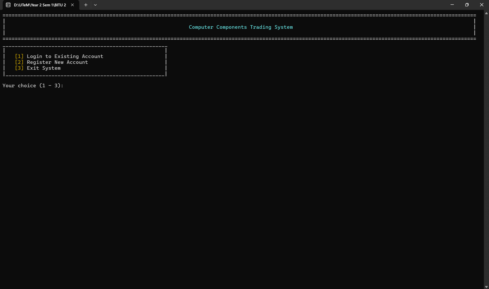
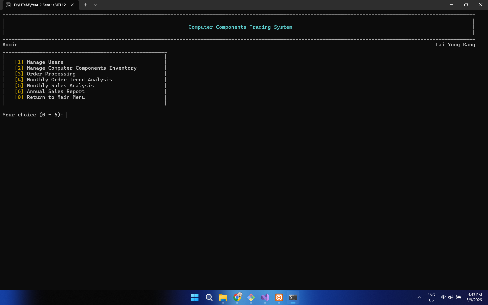
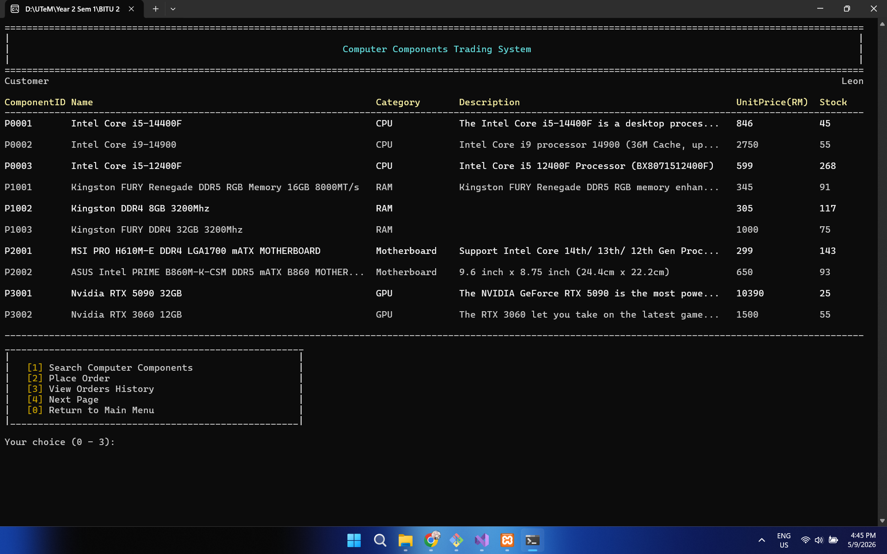
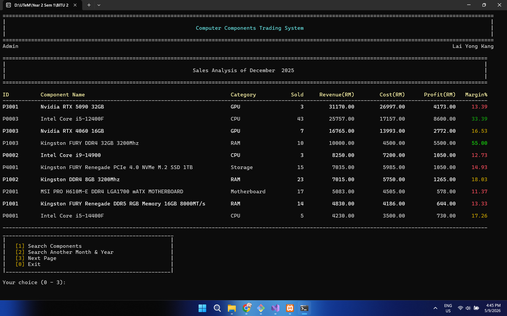

# Computer Components Trading System

A C++ and MySQL based trading system designed for computer hardware businesses to manage inventory, customer orders, and sales analysis efficiently.

---

## Overview

The Computer Components Trading System helps computer hardware merchants transition from traditional physical stores to an online trading environment. The system simplifies inventory management, customer order processing, and sales reporting while reducing dependency on third-party e-commerce platforms.

This project was developed as a university workshop project using C++ and MySQL.

---

## Features

### Admin Module

#### User Management
- Add users
- Edit users
- Delete users
- Search users

#### Inventory Management
- Add computer components
- Edit component details
- Delete components
- Search components

#### Order Management
- Search customer orders
- Update delivery status
- Delete orders

#### Sales & Analysis
- Monthly sales analysis
- Annual sales reports
- Order trend analysis
- Profit margin calculation

---

### Customer Module

- Register account
- Login system
- Browse computer components
- Search and filter components
- Place orders
- View order history

---

## Technologies Used

- C++
- MySQL
- MySQL Connector/C++
- Visual Studio
- Console-based User Interface

---

## Database Structure

The system uses three main tables:

### Users
- UserID
- Name
- Email
- Password
- Role
- Status
- DateRegistered

### Components
- ComponentID
- Name
- Category
- Description
- CostPrice
- UnitPrice
- QuantityInStock
- DateAdded

### Orders
- OrderID
- UserID
- ComponentID
- Quantity
- TotalAmount
- DateOrdered
- Status

---

## System Modules

### 1. User Management
Handles customer/admin registration and login authentication.

### 2. Inventory Management
Allows admin to manage computer hardware inventory efficiently.

### 3. Order Processing
Handles customer purchasing workflow and delivery status updates.

### 4. Sales Analysis & Reporting
Generates monthly and annual sales reports with profit calculations and trend analysis.

---

## Screenshots

### Main Menu


### Admin Menu


### Customer Menu


### Monthly Sales Analysis


---

## Installation

### 1. Clone the repository

```bash
git clone https://github.com/LaiYK02/computer_components_trading_system.git
```

### 2. Open the project
Open the `.sln` file using Visual Studio.

### 3. Configure MySQL
- Create the database
- Import the SQL file
- Configure MySQL connection settings

### 4. Build and Run
Build the project in Visual Studio and run the application.

---

## Future Improvements

- GUI version
- Online payment integration
- Real-time delivery tracking
- Better analytics dashboard
- Product image support
- Multi-language support

---

## Author

**Lai Yong Kang**  
Universiti Teknikal Malaysia Melaka (UTeM)

---

## License

This project is licensed under the MIT License.